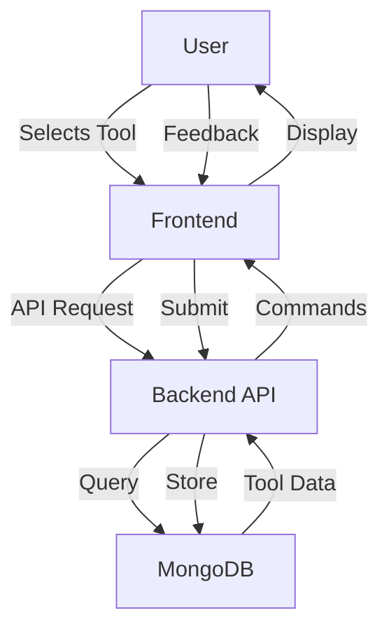
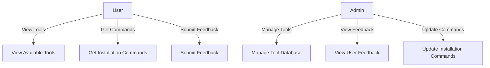

# ToolBatcher - Cross Platform Development Tool Manager

## Abstract
ToolBatcher is a comprehensive web application designed to streamline the development environment setup process across different operating systems. It provides an intuitive interface for developers to manage and install development tools, receive installation commands based on their operating system, and share feedback. The application simplifies the often complex process of setting up development environments by providing verified installation commands and maintaining a consistent toolset across different platforms.

## Modules and Functionalities

### 1. Frontend Modules

#### Core Components
- **Navbar**: Navigation component providing access to different sections of the application
- **Hero**: Landing page component showcasing main features
- **ToolSelector**: Interactive component for selecting development tools
- **CodeEditor**: Component for displaying and copying installation commands
- **FeedbackForm**: User feedback collection interface
- **Documentation**: Comprehensive usage guidelines and documentation
- **AdminPage**: Administrative interface for managing tool data and feedback

#### Features
- Responsive design using TailwindCSS
- Cross-browser compatibility
- Interactive UI elements
- Real-time command generation
- Copy-to-clipboard functionality
- Form validation
- Admin dashboard

### 2. Backend Modules

#### API Controllers
- **toolController**: Manages tool-related operations
- **feedbackController**: Handles feedback submission and retrieval

#### Data Models
- **ToolCommand**: Schema for tool installation commands
- **Feedback**: Schema for user feedback storage

#### Routes
- **/api/tools**: Tool management endpoints
- **/api/feedback**: Feedback management endpoints

## Software Stack

### Frontend
- React.js (v18)
- Vite.js
- TailwindCSS
- ESLint
- PostCSS

### Backend
- Node.js
- Express.js
- MongoDB
- Mongoose ODM

### Development Tools
- Git
- npm/yarn
- VS Code
- MongoDB Compass

## System Architecture Diagrams

### Data Flow Diagram


### Use Case Diagram


## Database Schema

### ToolCommand Collection
```javascript
{
    toolName: String,
    versions: [String],
    commands: {
        linux: String,
        macos: String,
        windows: String
    }
}
```

### Feedback Collection
```javascript
{
    userId: String,
    toolName: String,
    rating: Number,
    comments: String,
    timestamp: Date
}
```

## Source Code Examples

### 1. Backend API Setup (index.js)
```javascript
const express = require('express');
const cors = require('cors');
const connectDB = require('./config/database');
const toolRoutes = require('./routes/tools');
const feedbackRoutes = require('./routes/feedback');

const app = express();

// Connect to MongoDB
connectDB();

const corsOptions = {
  origin: 'http://localhost:3000',
  optionsSuccessStatus: 200
};
app.use(cors(corsOptions));

app.use(express.json());

// Routes
app.use('/api/tools', toolRoutes);
app.use('/api/feedback', feedbackRoutes);

const PORT = process.env.PORT || 3002;
app.listen(PORT, () => {
    console.log(`Backend running on port ${PORT}`);
});
```

### 2. Frontend Tool Selector Component
```jsx
import React, { useState, useEffect } from 'react';
import axios from 'axios';

const ToolSelector = () => {
    const [tools, setTools] = useState([]);
    const [selectedTool, setSelectedTool] = useState(null);
    const [commands, setCommands] = useState({});
    const [os, setOs] = useState('windows');

    useEffect(() => {
        const fetchTools = async () => {
            try {
                const response = await axios.get('http://localhost:3002/api/tools');
                setTools(response.data);
            } catch (error) {
                console.error('Error fetching tools:', error);
            }
        };
        fetchTools();
    }, []);

    const handleToolSelect = async (tool) => {
        setSelectedTool(tool);
        try {
            const response = await axios.get(`http://localhost:3002/api/tools/${tool._id}`);
            setCommands(response.data.commands);
        } catch (error) {
            console.error('Error fetching commands:', error);
        }
    };

    return (
        <div className="container mx-auto p-4">
            <div className="mb-4">
                <select 
                    onChange={(e) => setOs(e.target.value)}
                    className="border p-2 rounded"
                >
                    <option value="windows">Windows</option>
                    <option value="macos">MacOS</option>
                    <option value="linux">Linux</option>
                </select>
            </div>
            
            <div className="grid grid-cols-3 gap-4">
                {tools.map((tool) => (
                    <div 
                        key={tool._id}
                        className={`p-4 border rounded cursor-pointer ${
                            selectedTool?._id === tool._id ? 'bg-blue-100' : ''
                        }`}
                        onClick={() => handleToolSelect(tool)}
                    >
                        <h3 className="font-bold">{tool.toolName}</h3>
                        <p>Versions: {tool.versions.join(', ')}</p>
                    </div>
                ))}
            </div>
            
            {selectedTool && commands[os] && (
                <div className="mt-4 p-4 bg-gray-100 rounded">
                    <h4 className="font-bold mb-2">Installation Command:</h4>
                    <pre className="bg-black text-white p-2 rounded">
                        {commands[os]}
                    </pre>
                </div>
            )}
        </div>
    );
};

export default ToolSelector;
```

### 3. Database Configuration
```javascript
const mongoose = require('mongoose');

const connectDB = async () => {
    try {
        await mongoose.connect('mongodb://localhost:27017/toolbatcher', {
            useNewUrlParser: true,
            useUnifiedTopology: true,
        });
        console.log('MongoDB connected successfully');
    } catch (error) {
        console.error('MongoDB connection error:', error);
        process.exit(1);
    }
};

module.exports = connectDB;
```

### 4. API Routes Implementation
```javascript
const express = require('express');
const router = express.Router();
const ToolCommand = require('../models/ToolCommand');

// Get all tools
router.get('/', async (req, res) => {
    try {
        const tools = await ToolCommand.find();
        res.json(tools);
    } catch (error) {
        res.status(500).json({ message: error.message });
    }
});

// Get specific tool
router.get('/:id', async (req, res) => {
    try {
        const tool = await ToolCommand.findById(req.params.id);
        if (tool) {
            res.json(tool);
        } else {
            res.status(404).json({ message: 'Tool not found' });
        }
    } catch (error) {
        res.status(500).json({ message: error.message });
    }
});

// Add new tool
router.post('/', async (req, res) => {
    const tool = new ToolCommand({
        toolName: req.body.toolName,
        versions: req.body.versions,
        commands: req.body.commands
    });

    try {
        const newTool = await tool.save();
        res.status(201).json(newTool);
    } catch (error) {
        res.status(400).json({ message: error.message });
    }
});

module.exports = router;
```